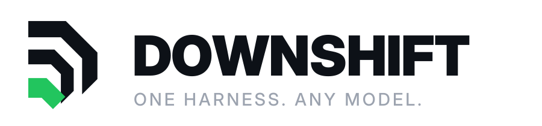
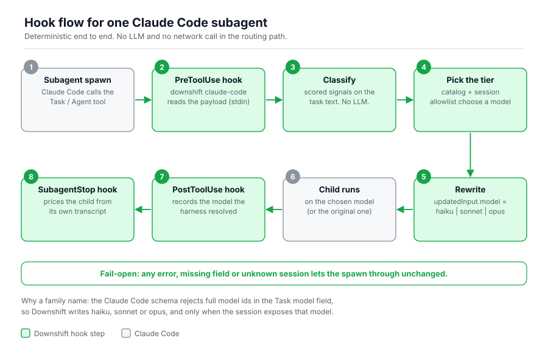
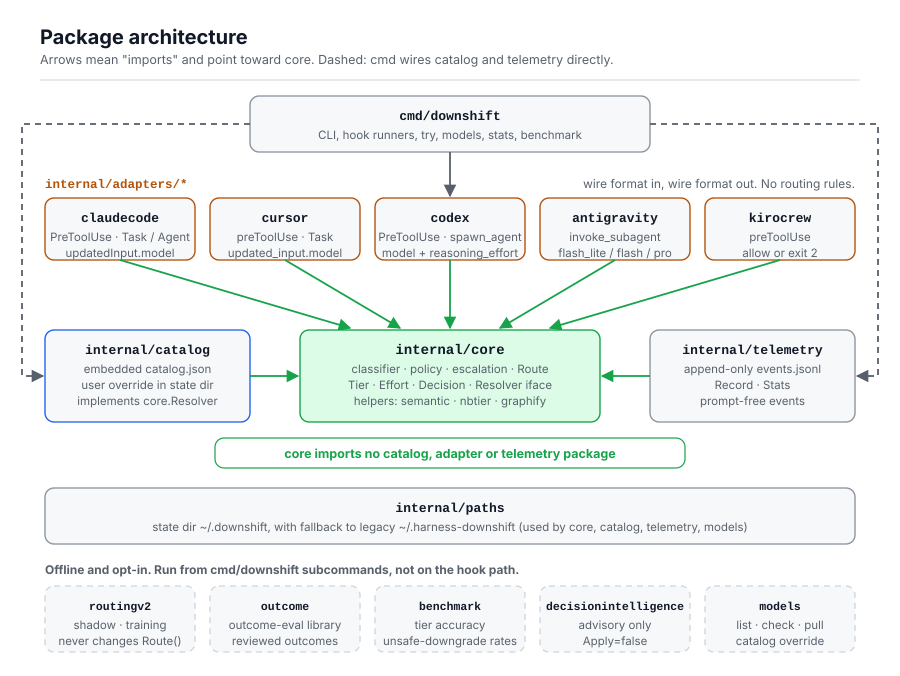

<div align="center">

<picture>
  <source media="(prefers-color-scheme: dark)" srcset="docs/brand/downshift-logo-dark.svg">
  
</picture>

**Deterministic model routing for coding-agent subagents. No LLM in the routing loop.**

[](https://github.com/tiagovilasboas/downshift/actions/workflows/ci.yml)
[](LICENSE)
[](https://go.dev)
[](https://github.com/tiagovilasboas/downshift/releases)
[](#status)

[Install](docs/install.md) · [Docs](docs/README.md) · [Harness support](#harness-support) · [Contributing](#contributing)

<!-- GitHub themed-picture uses the first dark source and ignores max-width, so a mobile source here is stretched to the column width. -->
<picture>
  <source media="(prefers-color-scheme: dark)" srcset="docs/img/hook-flow-dark.svg">
  
</picture>

</div>

> **Beta.** Whether a rewrite is applied depends on the harness and plan, not only on Downshift. Read [plan compatibility](docs/install.md#plan-compatibility--read-before-installing) before installing, and see [Harness support](#harness-support) for what has been verified.

## What it is

Downshift is a single Go binary that runs as a **hook** in your coding harness. When the harness is about to spawn a **subagent** (a child task), Downshift scores the task text, picks a tier (small / mid / frontier) and a reasoning effort, and rewrites **only that subagent's model** to a right-sized one from your session's available models. The parent session model never changes. Same input, same decision. No network calls, no API keys.

**Example:** Your session runs Claude Sonnet 5.5. You spawn 3 subagents — Downshift may route them to Haiku, Sonnet, and Opus respectively, based on task complexity. Billing and token usage happen at the subagent tier, not the session.

**What it is not:** an HTTP gateway or proxy (that is LiteLLM's job), a hosted model marketplace (OpenRouter), or an LLM-based classifier (Downshift uses deterministic signals + optional local MiniLM semantic scoring). It only acts on subagent spawns inside harnesses that expose a pre-tool hook. Comparison: [docs/when-to-use.md](docs/when-to-use.md).

## How it works

**Session model stays fixed. Subagent models get routed.**

```
Parent (e.g. Claude Sonnet 5.5) spawns 3 tasks:

  Task 1: "rename a variable"       → trivial    → Haiku (¢ cheaper)
  Task 2: "refactor a module"       → normal     → Sonnet (same tier)
  Task 3: "design a new algorithm"  → complex    → Opus ($ more capable)

Billing and token usage happen at the subagent tier, not the session.
```

**The routing loop:**

1. **Intercept.** The harness fires a `PreToolUse` hook when a subagent is about to start. Downshift reads the task text in memory only; prompts are never stored.
2. **Classify.** Deterministic signals (`internal/core`) + optional local MiniLM semantic scoring map the task to a complexity level: trivial, normal, review, or preserved.
3. **Choose.** Policy picks a tier. The target must come from the session's model list, ordered least to most capable ([session-models.md](docs/session-models.md)).
4. **Rewrite or stay out.** Downshift returns the new model in `updatedInput`. If anything is unknown or fails, it does nothing and the spawn runs unchanged (fail-open).

Internals: [docs/architecture.md](docs/architecture.md). The full runtime routing diagram is [here](docs/brand/downshift-routing-runtime-light.svg) ([dark](docs/brand/downshift-routing-runtime-dark.svg)).

<picture>
  <source media="(prefers-color-scheme: dark)" srcset="docs/img/architecture-dark.svg">
  
</picture>

## Quickstart (Claude Code)

**1. Install** (macOS / Linux; see [install.md](docs/install.md) for `go install` and Windows):

```bash
curl -fsSL https://raw.githubusercontent.com/tiagovilasboas/downshift/main/install.sh | sh
```

**2. Tell Downshift which models your session can use.** Without this the hook never rewrites anything. List the model ids from your picker, **least to most capable**, in `~/.downshift/session-models.json` (or point `DOWNSHIFT_SESSION_MODELS` at a file):

```json
{
  "claude-code": ["claude-haiku-5-5", "claude-sonnet-5-5", "claude-opus-5-5"]
}
```

Use the ids your account really offers; the file is yours to maintain. Details and per-session lists: [session-models.md](docs/session-models.md).

Claude Code is not limited to three models. The example stops at Opus on purpose: upshift writes the **last** id in this list, so an expensive frontier model stays out until you opt in. Append `claude-fable-5-1` (the hook writes the family name `fable`) only if you want that upshift.

Or let Downshift ask the harness: `downshift models discover` reads the models your account can use (Codex, Kiro, Grok, and the Anthropic API with a key) and writes a ranked cache that hooks use after your file. See [session-discovery.md](docs/session-discovery.md).

**3. Add the hook** to `~/.claude/settings.json`:

```json
{
  "hooks": {
    "PreToolUse": [
      { "matcher": "Task", "hooks": [{ "type": "command", "command": "downshift claude-code" }] }
    ]
  }
}
```

Claude Code's `Task` schema accepts only family names (`haiku`, `sonnet`, `opus`, `fable`) in `model`. Downshift writes the catalog's family name for you and leaves the spawn alone when a model has none.

**4. Verify.**

```bash
downshift doctor                                          # version, state dir, catalog source
downshift try "rename the userId variable" claude-code    # classification and recommended model
```

Then spawn a trivial subagent in Claude Code; stderr shows a line like `downshift: TRIVIAL task → downshift to …`. That proves the hook ran. To confirm the harness applied the rewrite, follow [Verify the rewrite was honored](docs/install.md#quickstart--zero-to-working-hook-in-2-minutes). Other harnesses (Cursor, Codex, Antigravity, KiroCrew, Grok) are in [install.md](docs/install.md).

## Harness support

| Harness | Subagent tool | Mechanism | Rewrite honored (evidence) |
|---|---|---|---|
| **Claude Code** | `Task` / `Agent`, paid plans | `PreToolUse` → `updatedInput.model` | Yes, observed 2026-10-06 ([write-up](docs/evidence/claude-code-rewrite-honored-2026-10-06.md)) |
| **Codex** | `spawn_agent` (`multi_agent_v2`) | `PreToolUse` → model + `reasoning_effort` | Inferred, not observed, 2026-10-02 ([write-up](docs/evidence/codex-rewrite-honored-2026-10-02.md)) |
| **Cursor** | `Task` | `preToolUse` → `updated_input.model` | Unconfirmed; discarded on Free and legacy Pro plans |
| **Antigravity** | `invoke_subagent` | `PreToolUse` overwrite | Not yet observed on a real spawn |
| **KiroCrew** | `spawn_run` / `spawn_sub_agents` | `preToolUse` policy (exit 0/2); `postToolUse` wired for compliance observation | Policy mode (no rewrite channel); compliance observer in labs |
| **Grok CLI** | `spawn_subagent` | Config in `config.toml`, not a hook | No hook rewrite |

Adapters ship for all of the above; the table reports evidence, not just code. Plans, caveats and revalidation rules: [harness-matrix.md](docs/harness-matrix.md).

## Context optimization & native compression

Downshift includes a built-in, zero-dependency **Native Context Compressor** (`downshift context compress`) and event-driven **Context Sensor** to govern context token volume without altering critical failure traces.

- **Enabled by default:** Downshift Native Context Compressor runs in-process by default to govern context token volume. Can be disabled at any time (`downshift context disable`).
- **Zero external dependencies:** Pure in-process Go engine; zero Python, Rust, Node or LLM runtime requirements.
- **Fail-open & error preservation:** Safe squelch on verbose successes (`go test`, `git status`, logs); never touches errors, stack traces, or failing suites.
- **Measurable impact:** Reduces verbose command output by 60%–90% (e.g. 15k-token test suites down to ~400 tokens), reaching up to ~80% total cost reduction when combined with model routing.
- **Management CLI:**
  ```bash
  downshift context status      # Show optimization status & active provider
  downshift context providers   # List supported optimization providers
  downshift context doctor      # Inspect local compressor & harnesses
  downshift context enable      # Enable built-in native compressor (or specify provider)
  downshift context disable     # Revert configurations back to raw state
  downshift context metrics     # Inspect token savings & sensor observations
  downshift context compress    # Deterministically compact tool output via stdin
  downshift context benchmark   # Compare optimization scenarios (baseline vs routing vs compression vs both)
  ```

See [the context optimization guide](docs/context-optimization.md) for architecture, harness contracts, and failure handling policies.

## Cost and metrics

- **Estimated, not billed.** `downshift stats --days=7` reports savings estimated from routing decisions. They are not a provider invoice, and no billing-period comparison has been published yet.
- **Real usage on Claude Code (optional).** Add a `SubagentStop` hook running `downshift claude-code-subagent-stop` to record tokens and cost per subagent from its own transcript. Setup and limits: [session-models.md](docs/session-models.md#claude-code-real-usage).
- **Local only.** Events go to a local `events.jsonl` in the state directory; prompts are not stored. Export format: [stats-export.md](docs/stats-export.md).
- **Classifier numbers.** Published tier accuracy and outcome-eval results, with their dates and caveats, are in [benchmark/REPORT.md](benchmark/REPORT.md). Tune the classifier with `downshift try` and [docs/contrib/classifier.md](docs/contrib/classifier.md).

## Documentation

[INSTALL](docs/install.md) · [CONFIG](docs/config.md) · [session models](docs/session-models.md) · [session discovery](docs/session-discovery.md) · [ARCHITECTURE](docs/architecture.md) · [HARNESS-MATRIX](docs/harness-matrix.md) · [WHEN-TO-USE](docs/when-to-use.md) · [examples](examples/README.md) · [full index](docs/README.md) · [Português](docs/pt/README.md)

Project: [ROADMAP](ROADMAP.md) · [GOVERNANCE](GOVERNANCE.md) · [beta exit criteria](docs/beta-exit.md)

**For AI agents:** start with [docs/install.md](docs/install.md), [AGENTS.md](AGENTS.md) and [llms.txt](llms.txt).

## Contributing

The most valuable contribution is a **misrouted prompt**: open an issue with the `downshift try` output and the tier you expected. Evidence that a rewrite was (or was not) honored on your harness and plan is just as welcome. See [CONTRIBUTING.md](CONTRIBUTING.md).

## Status

**Beta.** The adapters ship, but the limiting factor is often harness or plan support rather than the router. Exit criteria are tracked in [docs/beta-exit.md](docs/beta-exit.md).

## License

Apache License 2.0. See [LICENSE](LICENSE), [NOTICE](NOTICE) and [docs/relicense.md](docs/relicense.md).

Downshift by Tiago de Carvalho Vilas Boas · https://github.com/tiagovilasboas/downshift

Conceptual backbone: [Harness engineering (Fowler)](https://martinfowler.com/articles/harness-engineering.html).
