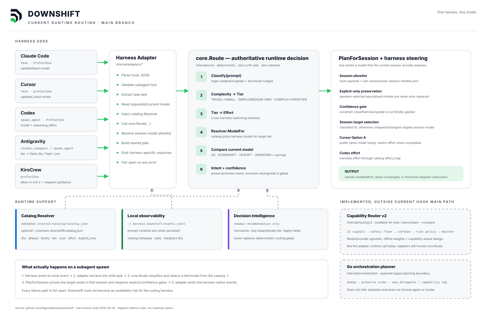

# Downshift

[](https://github.com/tiagovilasboas/downshift/actions/workflows/ci.yml)
[](LICENSE)
[](https://go.dev)
[](https://github.com/tiagovilasboas/downshift/releases)

**Deterministic model routing for AI workloads.**

Downshift classifies each workload, applies catalog policy, and selects model tier and reasoning effort **before execution**—without an LLM in the routing loop. One Go binary: use it as a **coding harness hook** today; the same core is gateway-shaped for tomorrow.

```
Subagent / request
       ↓
  classify (rules + optional semantic boost)
       ↓
  policy + catalog → tier & model
       ↓
  execute on the chosen model
```

**Works today with Claude Code, Cursor, Codex, Antigravity, and KiroCrew.** Single binary, no runtime dependencies, no network calls for routing, no API keys to pick a tier.



> **Beta — practical testing phase.** Harness plans and builds vary in how faithfully they honor `updatedInput.model`. Read [plan compatibility](docs/INSTALL.md#plan-compatibility--read-before-installing) before installing.

### Why Downshift?

| | |
|---|---|
| **Right-sized models** | Trivial tasks downshift to small tiers; complex work stays on frontier. |
| **Deterministic** | Scored signals, not an LLM classifier, on the hot path. |
| **Testable** | `downshift try`, published metrics ([benchmark/REPORT.md](benchmark/REPORT.md)), optional shadow (`DOWNSHIFT_SHADOW_WEIGHTS`). |
| **Observable** | Local telemetry (`events.jsonl`), feedback with explicit `--required-tier` for training labels. |
| **Harness-agnostic core** | Adapters only encode I/O; routing lives in `internal/core`. |

Use it for **subagent spawn routing** when you want offline, deterministic tier selection. It is **not** an HTTP gateway (LiteLLM) or a hosted marketplace (OpenRouter). Comparison: [docs/WHEN-TO-USE.md](docs/WHEN-TO-USE.md).

**Keywords:** model routing · LLM cost optimization · agent hooks · Claude Code · Cursor · Codex · deterministic router · Downshift

---

## Quickstart

```bash
curl -fsSL https://raw.githubusercontent.com/tiagovilasboas/downshift/main/install.sh | sh
downshift doctor
downshift try "rename the userId variable" claude-code
```

**Claude Code** — add to `~/.claude/settings.json`:

```json
{
  "hooks": {
    "PreToolUse": [
      { "matcher": "Task", "hooks": [{ "type": "command", "command": "downshift claude-code" }] }
    ]
  }
}
```

When routing fires, stderr shows the decision, for example:

```text
downshift: TRIVIAL task → downshift to claude-haiku-4-5 (~75% cheaper)
```

**Full setup** (Cursor, Codex, Antigravity, KiroCrew, Grok, session allowlist, dsmon, troubleshooting): **[docs/INSTALL.md](docs/INSTALL.md)**.

**AI agents:** start with [docs/INSTALL.md](docs/INSTALL.md), [AGENTS.md](AGENTS.md), and [llms.txt](llms.txt).

---

## Documentation

| Doc | Audience |
|-----|----------|
| **[INSTALL.md](docs/INSTALL.md)** | Install binary, wire hooks, verify rewrite honored |
| [ARCHITECTURE.md](docs/ARCHITECTURE.md) | Packages, hook flow, state dir |
| [CONFIG.md](docs/CONFIG.md) | `~/.downshift`, env vars, migration |
| [session-models.md](docs/session-models.md) | Session allowlist (required for rewrites) |
| [HARNESS-MATRIX.md](docs/HARNESS-MATRIX.md) | Plan × harness × rewrite-honored evidence |
| [WHEN-TO-USE.md](docs/WHEN-TO-USE.md) | Downshift vs gateways |
| [examples/](examples/README.md) | JSON fixtures for local hook tests |
| [docs/README.md](docs/README.md) | Full index |
| [pt/README.md](docs/pt/README.md) | Documentação em português |

**Project:** [ROADMAP.md](ROADMAP.md) · [GOVERNANCE.md](GOVERNANCE.md) · [BETA-EXIT.md](docs/BETA-EXIT.md) · [LICENSE](LICENSE) · [MONETIZATION.md](MONETIZATION.md)

Optional: [LangGraph orchestration](docs/LANGGRAPH-ORCHESTRATION.md) (planner only; routing stays in Go).

---

## Harness support

| Harness | Subagents | Mechanism | Status |
|---|---|---|---|
| **Claude Code** | Task (paid plans) | `PreToolUse` → `updatedInput.model` | shipped |
| **Cursor** | Task | `preToolUse` → `updated_input.model` | shipped |
| **Codex** | `spawn_agent` (multi_agent_v2) | `PreToolUse` → model + `reasoning_effort` | shipped |
| **Antigravity** | `invoke_subagent` | `PreToolUse` → overwrite | shipped |
| **KiroCrew** | `spawn_run` / `spawn_sub_agents` | policy mode (exit 0/2, no rewrite) | shipped |
| **Grok CLI** | `spawn_subagent` | config in `config.toml`, not hook | see INSTALL |

Rewrite adapters swap the child model in place; KiroCrew blocks with stderr when tier mismatch is confident. Details: [docs/INSTALL.md](docs/INSTALL.md).

---

## Plan compatibility (summary)

| Harness | Works well when |
|---|---|
| Claude Code | Pro / Max / Teams / API (not Free) |
| Codex | `hooks` + `multi_agent_v2` enabled |
| Cursor | Usage-based Pro/Ultra with expanded Task model selection |

On free or legacy Cursor plans the hook may run but **ignore** the model rewrite. Full tables: [docs/INSTALL.md#plan-compatibility--read-before-installing](docs/INSTALL.md#plan-compatibility--read-before-installing) · [HARNESS-MATRIX.md](docs/HARNESS-MATRIX.md).

---

## How routing works

Local scoring in Go, fail-open, same input → same tier. Complexity maps to catalog **tiers** (small / mid / frontier). Tune with `downshift try` and [docs/contrib/classifier.md](docs/contrib/classifier.md).

**Catalog override:** `~/.downshift/catalog.json` (legacy `~/.harness-downshift/`). `downshift models list` · `downshift doctor`.

**Experimental v2** (shadow/offline only): [CAPABILITY-ROUTER-V2.md](docs/CAPABILITY-ROUTER-V2.md).


---

## Cost and metrics

Directional savings from routing decisions, not provider invoices. After a week: `downshift stats --days=7`. Privacy: prompts are not stored; see [docs/INSTALL.md](docs/INSTALL.md) and [stats-export.md](docs/stats-export.md).

Classifier summary (maintainer-updated): [benchmark/REPORT.md](benchmark/REPORT.md).

---

## Contributing

The most valuable contribution is a **misrouted prompt** — open an issue with `downshift try` output vs what you expected. See [CONTRIBUTING.md](CONTRIBUTING.md).

---

## Status

**Beta — practical testing phase.** Adapters ship for major coding harnesses; the limiting factor is often harness plan support, not the router. Feedback wanted: misroutes and rewrite-honored evidence on your plan.

---

## License

**Apache License 2.0.** See [LICENSE](LICENSE), [NOTICE](NOTICE), [docs/RELICENSE.md](docs/RELICENSE.md). Prior BUSL: [LICENSE-BSL-1.1-ARCHIVE.md](LICENSE-BSL-1.1-ARCHIVE.md).

Downshift by [Tiago de Carvalho Vilas Boas](https://github.com/tiagovilasboas) · https://github.com/tiagovilasboas/downshift

Conceptual backbone: [Harness engineering (Fowler)](https://martinfowler.com/articles/harness-engineering.html).
