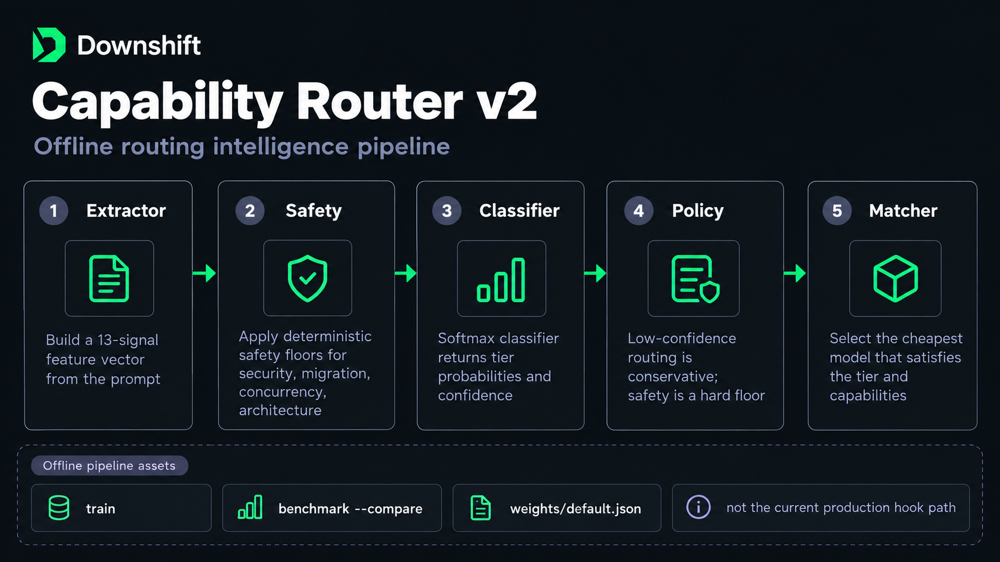

# Capability Router v2 (experimental)

> Downshift by Tiago de Carvalho Vilas Boas · https://github.com/tiagovilasboas/downshift

**Production hooks use v1:** `internal/core` regex scoring (+ optional semantic boost) →
`core.Route()` → catalog policy. **v2 is not on the hot path.**

| | v1 (production) | v2 (experimental) |
|---|-----------------|-------------------|
| Entry | PreToolUse adapters | CLI: `train`, `benchmark --compare`, shadow observation |
| Classifier | Deterministic signals | Softmax over 13 features (`internal/routingv2/`) |
| Model choice | Tier → cheapest in session allowlist | Matcher + profiles (design; not wired to hooks) |
| Training labels | `misroute:` issues → `signals.go` | Reviewed `--required-tier` only |



---

## Why v2 exists

v1 maps **task complexity** → **tier** in one step. That is fast and auditable, but
it mixes safety, capability, and cost in one score. v2 explores a separate
pipeline: extract features → classify tier probabilities → apply safety floor →
match a profile. The code lives under `internal/routingv2/` for offline eval and
future promotion **only with evidence**.

---

## What you can run today

```bash
# Compare legacy vs v2 on a labelled JSONL dataset
downshift benchmark path/to/dataset.jsonl --compare

# Train candidate weights from reviewed events (not from raw success clicks)
downshift train --from-events

# Observe a candidate beside production (does not change hook output)
export DOWNSHIFT_SHADOW_WEIGHTS=1
downshift shadow-report
```

Guides:

- [classifier-shadow.md](classifier-shadow.md) — shadow observation contract
- [contrib/classifier.md](contrib/classifier.md) — how v1 scoring works (tune here)
- [design/router-generalization.md](design/router-generalization.md) — eval methodology

---

## Promotion criteria (maintainer bar)

v2 must **not** replace v1 in hooks until:

1. Shadow or holdout metrics beat v1 on reviewed labels (not binary success alone).
2. Fail-open behavior is unchanged (spawn never blocked by router errors).
3. CHANGELOG + BETA-EXIT updated with evidence links.

Until then, treat v2 as **research infrastructure**, not a product promise.

---

## Package map (high level)

```
internal/routingv2/
  extractor/     # prompt → FeatureVector (no persistence of raw prompt in training path)
  classifier/    # softmax weights (embedded + optional ~/.downshift/weights.json)
  policy/        # risk-aware tier selection
  safety/        # deterministic floors
  matcher/       # tier + capabilities → catalog profile
  shadow/        # opt-in parallel observation
  training/      # events, metrics, train CLI backing
```

Dependencies point **inward**; `core` and adapters do not import v2 for routing.

---

## Full design archive

The original long-form design checklist (675+ lines, partially stale) is kept for
maintainers:

**[internal/capability-router-v2-full.md](internal/capability-router-v2-full.md)**

Do not treat unchecked boxes in that file as a public roadmap.
